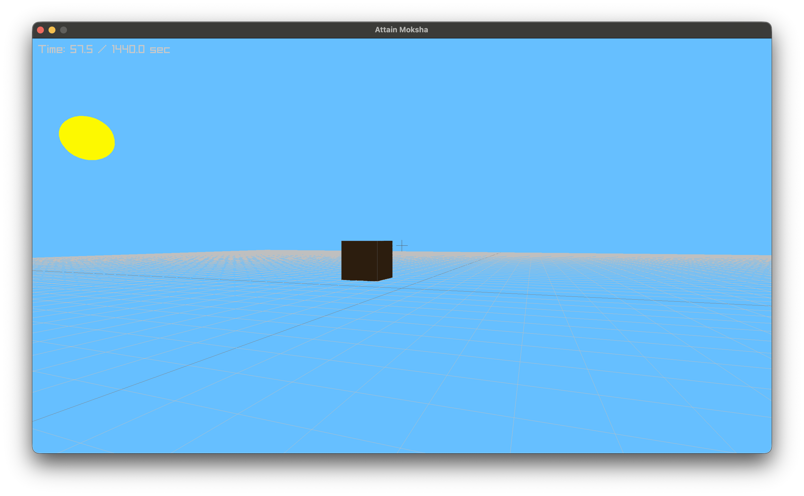

# About
Simple procedurally generated game in Raylib.

# How to run
```bash
cmake -S . -B build
cmake --build build
./build/Attain-Moksha
```

# Current Progress


- We have a Sun which goes full cycle [12 Min day 12 Min night]
- Cube which reflects off of the sun